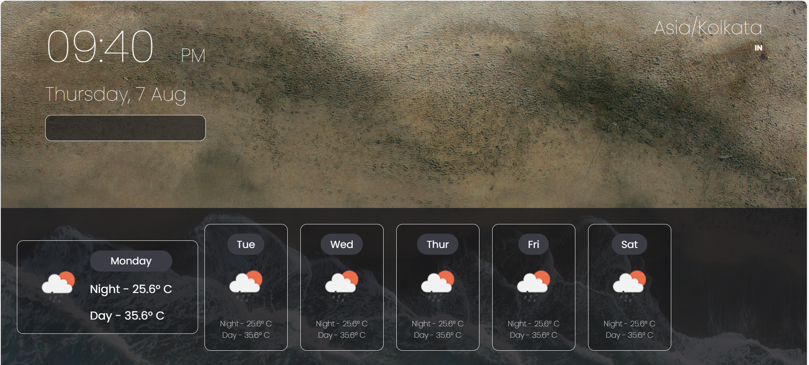

# 🌦️ Weather Forecasting Website

A responsive weather forecasting web application built using **HTML**, **CSS**, and **JavaScript**. It fetches real-time weather data for any city using a public API and displays temperature, humidity, wind speed, and weather conditions.

## 🚀 Features

- 🌍 Search weather by city name
- 🌡️ Displays temperature in Celsius
- 💧 Shows humidity, wind speed, and conditions
- 🖼️ Weather icons based on current conditions
- ⚡ Real-time data fetching from weather API
- 📱 Fully responsive design

## 🛠️ Tech Stack

- **Frontend**:
  - HTML
  - CSS
  - JavaScript

- **API**:
  - OpenWeatherMap API or any preferred public weather API

## 📸 Screenshots

